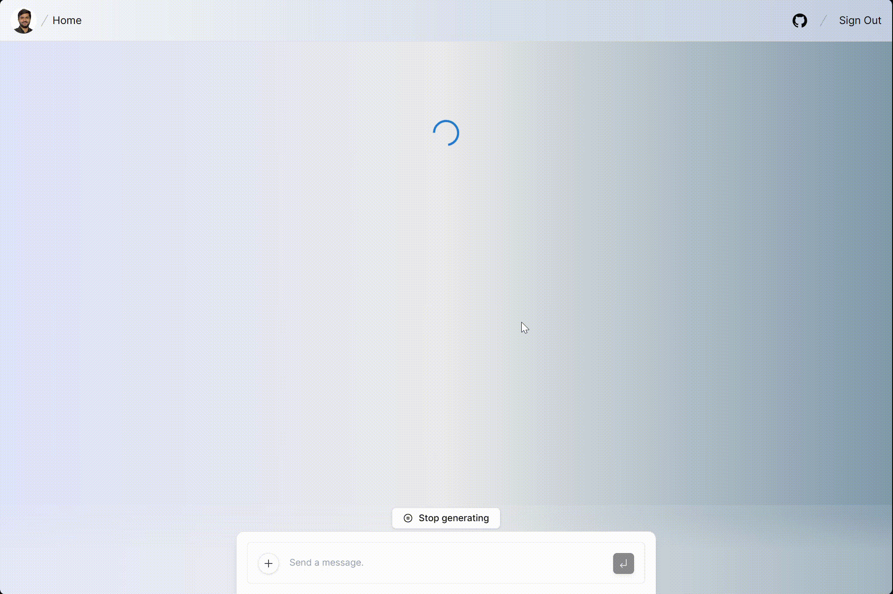

<a href="https://co-poet.taimoor0217.com">
  
  <h1 align="center">Co-Poet </h1>
</a>

### An AI based poetry generator
https://co-poet.taimoor0217.com
https://co-poet.vercel.app/

Co-poet is an AI based poetry generator built with OpenAI

### Stack
- [Next.js](https://nextjs.org) App Router
- [Vercel AI SDK](https://sdk.vercel.ai/docs) for streaming chat UI
- [Lang Chain](https://www.langchain.com/) for prompt chaining
- [React Server Components (RSCs)](https://react.dev), Suspense, and Server Actions
- [shadcn/ui](https://ui.shadcn.com)
- [Tailwind CSS](https://tailwindcss.com)
- [Material UI](https://radix-ui.com) for headless component primitives
- [Supabase](https://supabase.com) for authentication
- [Vercel](https://vercel.com) for deployment
- Edge runtime-ready

### Running locally
```
pnpm install
pnpm dev
```
